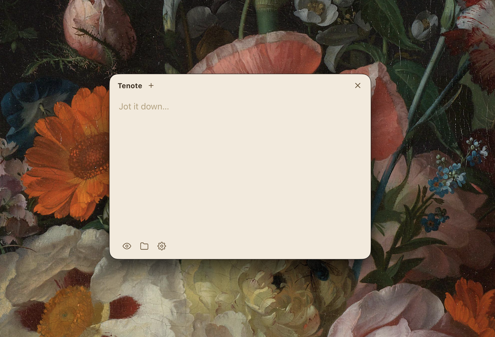

# Tenote

The simplest notes app for Mac. Press **⌥.** (Option+Period) anywhere on your
screen. A small card floats up, you type, it saves itself. That's the whole app.

**100% free. Open source. Your notes are plain text files you own forever.**



## Why "Tenote"?

The first working version was built for about **ten cents** of AI tokens. It felt
right for an app that proves good software can cost almost nothing to make, so it
costs you nothing to use. Free forever, MIT licensed.

*(iPhone app: coming soon.)*

## What it does

- One hotkey (**⌥.**) opens and closes it, from inside any app
- Every open is a fresh note. Whatever you were writing is already saved
- Notes save as **Markdown files** in `~/Documents/Tenote Notes`. Readable by
  anything, syncable anywhere
- Always on top, on the screen where your cursor is
- Auto-saves as you type; every note is timestamped
- Paste images straight into a note
- `#tags` become little chips at the bottom
- Markdown preview, a last-3-notes strip, an all-notes view, 5 themes
- Lives quietly in your menu bar. No Dock icon, no clutter

No accounts. No cloud. No tracking. No subscription.

## Install

### Option A: download the app (easiest)

1. Go to the [Releases page](../../releases/latest) and download `Tenote-x.y.z.dmg`.
2. Open the dmg and drag **Tenote** into **Applications**.
3. The first time you open it: **right-click → Open → Open**.
   (macOS warns about apps downloaded from the internet; this one-time step says
   you trust it. The app is unsigned. It's free software, so nobody paid Apple $99.)
4. Done. Press **⌥.** anywhere. The hotkey is built in, nothing else to set up.

### Option B: build from source

You need [Node.js](https://nodejs.org) (22 or newer) and git. Then:

```bash
git clone https://github.com/noemit/tenote.git
cd tenote
npm install
npm start
```

The ⌥. hotkey is built in, so you can stop here. **Recommended:** run one more
command to set up [skhd](https://github.com/koekeishiya/skhd), a tiny free hotkey
helper. With it, ⌥. works **even when Tenote isn't running yet** (it starts the
app for you):

```bash
npm run setup
```

What `npm run setup` does (and nothing else):

1. Checks if you have skhd; if not, installs it with Homebrew
   (or tells you what to do if you don't have Homebrew either).
2. Adds **one line** to `~/.skhdrc` pointing ⌥. at Tenote.
3. Starts skhd.

Afterwards macOS asks for **one permission**. skhd needs it to see your key
presses: **System Settings → Privacy & Security → Accessibility → turn on "skhd".**
Then press ⌥. anywhere and a note card appears.

## Your notes

Everything lives in `~/Documents/Tenote Notes/` as ordinary Markdown files:

```markdown
---
id: 2026-08-09_14-32-05
created: 2026-08-09T14:32:05.000Z
updated: 2026-08-09T14:34:12.000Z
tags: [idea, work]
---

Buy milk
```

They're yours. Open them in any editor, grep them, back them up, leave any time.
**Free sync:** move or symlink the folder into iCloud Drive, Dropbox, or Google
Drive and your notes sync themselves. Pasted images live in the `images/` subfolder.

## Handy things

- **Esc** or **⌘⏎** saves and closes the card
- **Deleting all the text** of a note deletes the note
- **＋** starts a new note; the strip at the bottom shows your last 3
- **⚙️** has themes, launch-at-login, and shortcuts to the folders
- The menu-bar card icon has all the same controls

## Uninstall

Quit from the menu-bar icon, then drag Tenote out of Applications (or stop
`npm start`). Your notes stay in `~/Documents/Tenote Notes`. Delete that folder
too if you don't want them. If you ran `npm run setup`: remove the Tenote lines
from `~/.skhdrc`, then run `skhd --stop-service`.

## Troubleshooting

- **⌥. does nothing.** Another app may have grabbed the shortcut. Check
  `~/Library/Logs/Tenote/main.log` for `shortcut` lines; the skhd setup (above)
  usually sidesteps this.
- **The skhd binding stopped working.** Run `skhd --restart-service`, and check
  that the Accessibility permission is still on.
- **The window won't come forward over a fullscreen app.** Click the menu-bar
  icon instead.

## For developers

Plain Node + Electron, **zero runtime dependencies**. `main.js` is the whole
backend; `renderer/` is the whole frontend. The renderer talks to the main process
over a small IPC bridge (`preload.js`), and skhd talks to the app over a tiny Unix
socket (`scripts/tenotectl.js`).

| Command | Does |
| --- | --- |
| `npm start` | Run the app (first run downloads the Electron binary) |
| `npm run setup` | Install & configure skhd for the ⌥. hotkey |
| `npm run logs` | Tail the log (`~/Library/Logs/Tenote/main.log`) |
| `npm run check` | Syntax-check all JS |
| `npm run icons` | Regenerate tray + app icons (pure-Node PNG encoder) |
| `npm run dist` | Build `dist/Tenote-*.dmg` + `.zip` with electron-builder |

| Env var | Effect |
| --- | --- |
| `TENOTE_SHORTCUT` | Override the built-in shortcut (e.g. `Ctrl+Shift+Space`); `0` disables it |
| `TENOTE_LOG_LEVEL` | `debug` for verbose logging |
| `TENOTE_LOG_DIR` | Custom log directory |
| `TENOTE_SOCKET` | Custom socket path (must match in tenotectl and the app) |
| `TENOTE_DEV_DIR` | Lets tenotectl start the app with `npm start` in this folder |
| `TENOTE_APP_PATH` | Path to a packaged Tenote.app for tenotectl to launch |

## Roadmap

- iPhone app (soon)
- Search across notes
- Plugin system (a community repo once there are plugins worth sharing)
- Signed & notarized dmg once the app has users to justify the Apple fee

## License

MIT. Do whatever you want with it. See [LICENSE](LICENSE).
