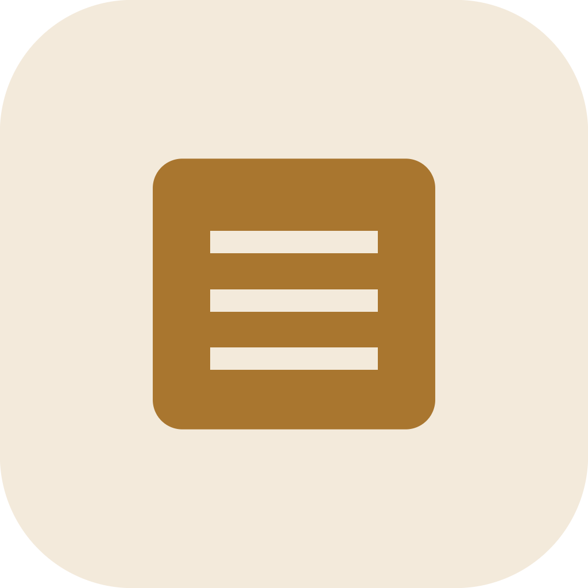
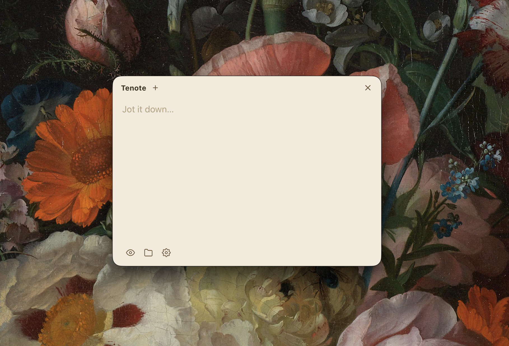

# Tenote

<p align="center">
  
</p>

The simplest notes app for Mac. Press **⌥.** (Option+Period) anywhere on your
screen. A small card floats up, you type, it saves itself. That's the whole app.

**100% free. Open source. Your notes are plain text files you own forever.**



## Why "Tenote"?

The first working version was built for about **ten cents** of AI tokens. It felt
right for an app that proves good software can cost almost nothing to make, so it
costs you nothing to use. Free forever, MIT licensed.

*(iPhone app: coming soon.)*

## What it does

- One hotkey (**⌥.**) opens and closes it, from inside any app
- Every open is a fresh note. Whatever you were writing is already saved
- Notes save as **Markdown files** in `~/Documents/Tenote Notes`. Readable by
  anything, syncable anywhere
- Always on top, appears next to your cursor
- Auto-saves as you type; every note is timestamped
- Paste images straight into a note — they render inline
- Select text, then **⌘B** bold or **⌘I** italic
- `#tags` become little chips at the bottom
- A last-3-notes strip, an all-notes view, 5 themes
- Lives quietly in your menu bar. No Dock icon, no clutter

No accounts. No cloud. No tracking. No subscription.

## Install

### Option A: download the app (easiest)

1. Go to the [Releases page](../../releases/latest) and download `Tenote-x.y.z.dmg`.
2. Open the dmg and drag **Tenote** into **Applications**.
3. Done. Press **⌥.** anywhere. The hotkey is built in, nothing else to set up.

Releases are signed with a Developer ID certificate and notarized by Apple, so
they open with no warnings. (If you're on an old, unsigned build and macOS says
the app "is damaged", run `xattr -dr com.apple.quarantine /Applications/Tenote.app`
once in Terminal, or just grab the latest release.)

### Option B: build from source

You need macOS 13.3+ and Xcode 15+ (or the Swift 5.9+ toolchain). Then:

```bash
git clone https://github.com/noemit/tenote.git
cd tenote
packaging/build-app.sh      # builds dist/Tenote.app
open dist/Tenote.app
```

For day-to-day hacking, `swift run Tenote` runs straight from the checkout.

The ⌥. hotkey is built in, so you can stop here. **Optional:** bind ⌥. through
[skhd](https://github.com/koekeishiya/skhd) so it works **even when Tenote isn't
running yet** (it starts the app for you):

```bash
scripts/setup-skhd.sh
```

It installs skhd with Homebrew if needed, adds **one line** to `~/.skhdrc`
pointing ⌥. at `Tenote.app/Contents/MacOS/tenotectl`, and starts skhd. macOS
then asks for one permission: **System Settings → Privacy & Security →
Accessibility → turn on "skhd".**

## Your notes

Everything lives in `~/Documents/Tenote Notes/` as ordinary Markdown files:

```markdown
---
id: 2026-08-09_14-32-05
created: 2026-08-09T14:32:05.000Z
updated: 2026-08-09T14:34:12.000Z
tags: [idea, work]
---

Buy milk
```

They're yours. Open them in any editor, grep them, back them up, leave any time.
**Free sync:** move or symlink the folder into iCloud Drive, Dropbox, or Google
Drive and your notes sync themselves. Pasted images live in the `images/` subfolder.

## Handy things

- **Esc** or **⌘⏎** saves and closes the card
- **Deleting all the text** of a note deletes the note
- **＋** starts a new note; the strip at the bottom shows your last 3
- **⚙️** has themes, hide-the-label, hide-the-recents-bar, launch-at-login, and a shortcut to your notes folder
- The menu-bar card icon has all the same controls

## Uninstall

Quit from the menu-bar icon, then drag Tenote out of Applications. Your notes stay in `~/Documents/Tenote Notes`. Delete that folder
too if you don't want them. If you ran `scripts/setup-skhd.sh`: remove the Tenote lines
from `~/.skhdrc`, then run `skhd --stop-service`.

## Troubleshooting

- **⌥. does nothing.** Another app may have grabbed the shortcut. Check
  `~/Library/Logs/Tenote/main.log` for `shortcut` lines; the skhd setup (above)
  usually sidesteps this.
- **The skhd binding stopped working.** Run `skhd --restart-service`, and check
  that the Accessibility permission is still on.
- **The window won't come forward over a fullscreen app.** Click the menu-bar
  icon instead.

## For developers

A native Swift/AppKit app, **zero third-party dependencies**.

| Path | What |
| --- | --- |
| `Sources/TenoteCore` | Notes, settings, logger, plugin host, JavaScriptCore runtime, socket, accelerators |
| `Sources/Tenote` | The app: floating card (`WKWebView`), menu-bar item, global hotkeys, IPC bridge |
| `Sources/tenotectl` | CLI used by skhd; talks to the app over a Unix socket |
| `renderer/` | The card's UI (HTML/CSS/JS), served to the web view via `tenote://` |
| `plugins/`, `examples/` | Builtin and example plugins (unchanged JS plugin API) |

| Command | Does |
| --- | --- |
| `swift run Tenote` | Run the app from the checkout |
| `swift test` | Run the core test suite |
| `packaging/build-app.sh` | Build `dist/Tenote.app` (ad-hoc signed) |
| `packaging/build-app.sh --dist` | Also sign (`SIGN_IDENTITY`), notarize and build `.zip` + `.dmg` |
| `tail -f ~/Library/Logs/Tenote/main.log` | Follow the log |

| Env var | Effect |
| --- | --- |
| `TENOTE_SHORTCUT` | Override the built-in shortcut (e.g. `Ctrl+Shift+Space`); `0` disables it |
| `TENOTE_LOG_LEVEL` | `debug` for verbose logging |
| `TENOTE_LOG_DIR` | Custom log directory |
| `TENOTE_SOCKET` | Custom socket path (must match in tenotectl and the app) |
| `TENOTE_PLUGINS` | Colon-separated extra plugin folders/files to load |
| `TENOTE_NO_PLUGINS` | `1` skips plugin activation for the session |
| `TENOTE_APP_PATH` | Path to a packaged Tenote.app for tenotectl to launch |

## Roadmap

- iPhone app (soon)
- Search across notes
- Plugin system (a community repo once there are plugins worth sharing)

## License

MIT. Do whatever you want with it. See [LICENSE](LICENSE).
